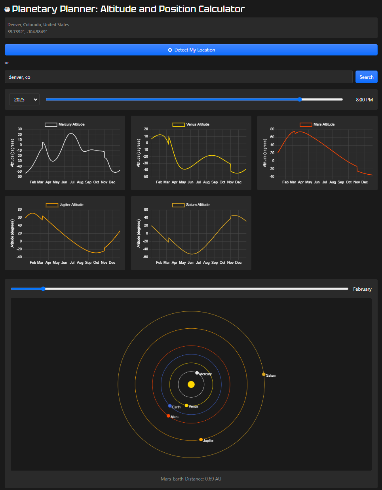

# JG Planetary Planner: Altitude and Position Visual Calculator for Astronomers

JGPlanetary is a WordPress plugin that helps astrophotographers and astronomers determine optimal planetary viewing times. It provides interactive visualizations of planetary altitudes and solar system positions throughout the year.

## Screenshot

### Main Dashboard

*The dashboard shows planetary altitudes and position, letting you find the optimal day and time to view and photograph planets.*

## Features

- Real-time planetary altitude calculations based on user location
- Interactive altitude graphs for Mercury, Venus, Mars, Jupiter, and Saturn
- Solar system visualization with accurate planetary positions
- Location detection or manual entry
- Customizable year and time selection
- Responsive design using Bootstrap
- Mars-Earth distance indicator

## Requirements

- WordPress 5.0 or higher
- PHP 7.4 or higher
- Modern web browser with JavaScript enabled
- Bootstrap 5.2.3 (included)

## Installation

1. Download the latest release from the GitHub repository
2. Upload the plugin files to the `/wp-content/plugins/jgplanetary` directory
3. Activate the plugin through the 'Plugins' screen in WordPress
4. Use the shortcode `[planetary_altitude]` to display the calculator on any page or post

## Usage

1. Place the shortcode `[planetary_altitude]` on any WordPress page or post
2. Set your location using either:
   - The "Detect My Location" button
   - Manual location search
3. Use the year selector and time slider to choose when you want to observe
4. View the altitude graphs for each planet
5. Explore the solar system visualization with the month slider

## Dependencies

- [Astronomy Engine](https://github.com/cosinekitty/astronomy) v2.1.17
- [Chart.js](https://www.chartjs.org/) v3.7.0
- [Bootstrap](https://getbootstrap.com/) v5.2.3
- jQuery (WordPress core)

## Development

### Building from Source

1. Clone the repository
2. Install dependencies (if using npm for development)
```bash
npm install